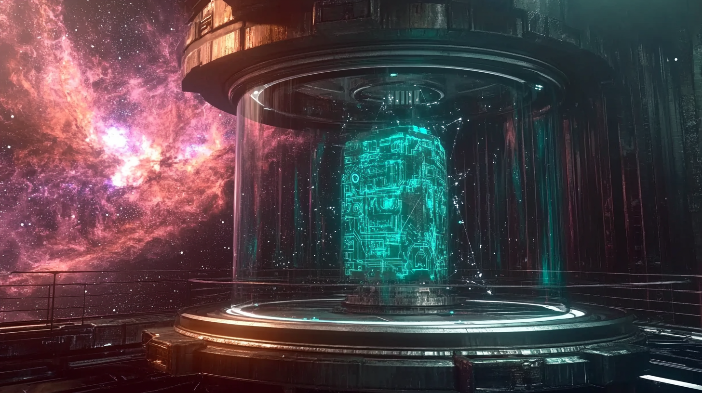

# Welcome to ToЧ Bin

  

  

    

      ToЧ Bin
    

    

      Build stunning, responsive sites
    

    

      <a href="contact.md" class="cta-button">Get Started</a>
    

  

---

## **Why ToЧ Bin?**

Because it builds stunning, responsive sites quickly and effectively. Whether showcasing a collection, launching a product, or creating a personal portfolio, ToЧ Bin empowers you to get started fast.

---

## **Features**

- **Interactive Design**: Create visually engaging sites that highlight your content.
- **Quick Setup**: Get started with minimal effort using pre-built templates.
- **Customizable Layouts**: Tailor your site to your project’s needs.

---

## **[Start Your Journey](contact.md)**

Take the first step in creating something amazing with ToЧ Bin. Build responsive, visually stunning sites in minutes.

[Visit Our Contact Page](contact.md) to get started today.

**ToЧ Bin**: Elevate your projects, effortlessly.
